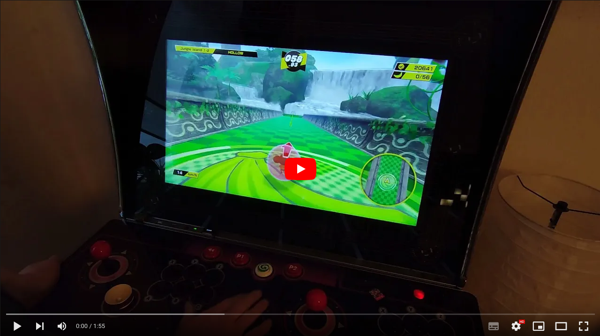
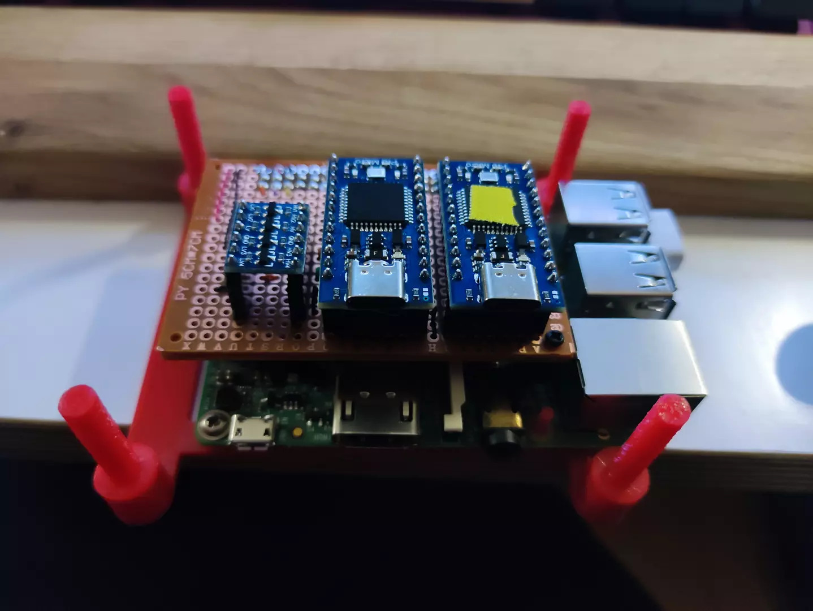

# Switch Input Proxy

The _Switch Input Proxy_ is a piece of software running on a mini linux computer like the raspberry pi and passes input events of USB HIDs like USB gamepads or trackballs etc. to the Nintendo Switch. It does it by passing the events via the I2C protocol to one or more Atmega32u4 dev boards which act as virtual gamepads to the Nintendo Switch. The Atmega32u4 has to run [Switch-I2C-Controller](https://github.com/Molorius/Switch-I2C-Controller).

I developed this software to be able to connect the Controls of my Atgames Legends Ultimate Arcade Cabinet to the Nintendo Switch.

**This project is a prototype and never might leave this state because it does everything I need it to do, at this moment in time at least.**
It is not very good documented and requires a bit of soldering, bash work and YAML-file editing to set up and configure. 

|  | 
|:--:| 
| *Raspberry PI with two Atmega32u4 virtual controller* |

## Switch-I2C-Controller

I have to thank [Molorius](https://github.com/Molorius) for this great piece of software, it did exactly what I needed for the _Switch Input Proxy_. Thanks to using I2C it is easy to connect 4 (or even more) gamepads to the Nintendo Switch. Each virtual controller needs one Atmega32u4 dev board and all are connected to the I2C bus of the Raspberry PI. All dev boards need a unique I2C address, please refer to the documentation of the [Switch-I2C-Controller Github project](https://github.com/Molorius/Switch-I2C-Controller) for details how to flash it and how to change the address.

## Display

I added to small _SSD 1306_ Oled screen to be able to display the currently active configuration profile. This display is also connected via I2C to the PI.

## Configuration

_Switch Input Proxy_ uses to configuration files, the _Global Configuration_ and the _Profile Configuration_. Both files are merged and support the same values. The _Profile Configuration_ have to be placed in a seperate directory and can be switched with a key combination.

### Global Config Example

    name: Global                        
    category: Default                   # Not used
    i2c_device: 1                       # ID of the I2C device, 1 is the default on the PI

    menu:
      event: BTN_MODE                   # HID event type used as a menu modifier key, find the type name with `evtest`
      device: 
        name: HID 0838:8918             # Name of the HID device, find it with `evtest`
        index: 1                        # Sometimes multiple USB devices have the same name. _index: 0_ will pick the first device etc.
        bindings:                       # Menu bindings
        - event: ABS_HAT0Y              # HID event type
          state: 1                      # value of the HID event at which the binding will fire
          invoke: NEXT_CONFIG           # menu event which will be fired
        - event: ABS_HAT0Y
          state: -1
          invoke: PREV_CONFIG
    
### Profile Config Example

    name: Default                       # Name of the profile, displayed in the display

    devices:                            # List of device configurations
      - name: HID 0838:8918             # Name of the HID device, find it with `evtest`
        index: 0                        
        bindings:                       
          - event: ABS_X                # HID event type
            address: 0x51               # I2C address of the Atmega32u4 dev board
            invoke: LX                  # Event invoked on the virtual gamepad, refer to the Switch-I2C-Controller project for a list of events
          - event: ABS_Y
            address: 0x51
            invoke: LY
        relative:                       # Special relative handler to convert Mouse / Trackball input into analog stick output
          - event: REL_X
            invoke: ABS_X
            mult: 1.5
          - event: REL_Y
            invoke: ABS_Y
            mult: 1.5
      
      - name: HID 0838:8918
        index: 1
        bindings:
          - event: BTN_Z
            address: 0x51
            invoke: L
          - event: BTN_TR
            address: 0x51
            invoke: R
          - event: BTN_EAST
            address: 0x51
            invoke: A
          .
          .
          .
      
